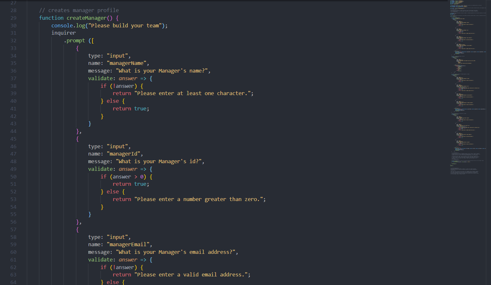
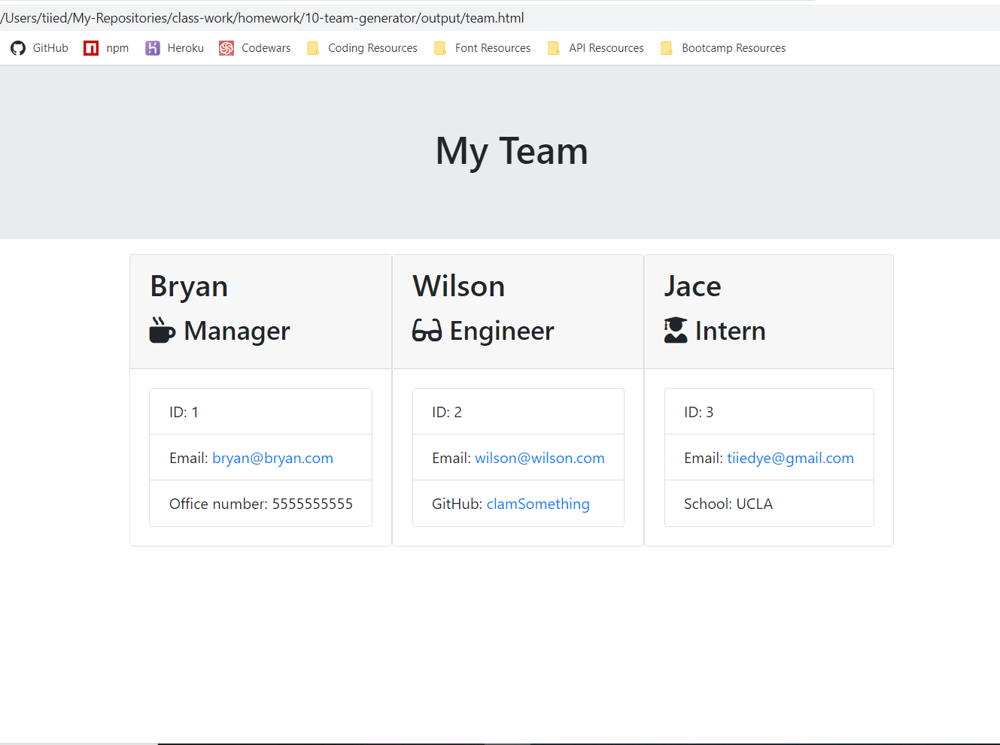

  

# Team Page Generator
A Node CLI app that uses inquirer to build a Team Page. After answering all the questions in the Command Line it produces and HTML file in the output using the information given.

Video: https://www.youtube.com/watch?v=mRdnn867nJQ&t

### Requirements for VS Code
* Node
* Inquirer
* fs

### Instructions
Write code to use inquirer to gather information about the development team members, and to create objects for each team member (using the correct classes as blueprints!)